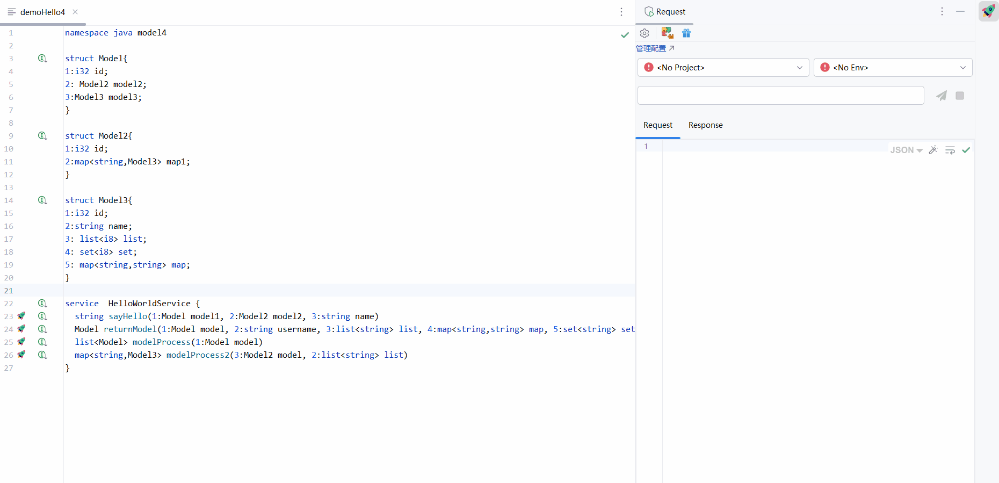
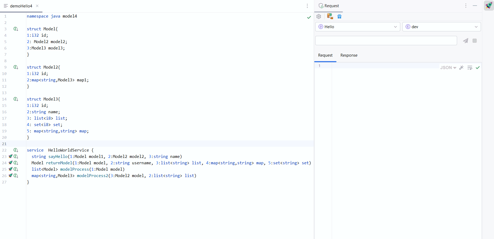

## License

This plugin is **not open-source**. It is a commercial plugin licensed via JetBrains Marketplace. All rights reserved.

## 🧩 Plugin Dependency

This plugin depends on another free plugin developed by the author: **Thrift Assistant**.  
You do **not** need to install it manually — it will be installed automatically when you install **Thrift Request**.

> ⚠️ Note: Thrift Assistant is based on **Thrift Support**. To avoid compatibility issues, please remove any other plugins based on Thrift Support before using this plugin.

---

## 🚀 Getting Started

### 1. Configure Projects & Environments

Before sending requests, please add your **project** and **environment** information.  
The plugin uses your environment configuration to manage requests uniformly.  
> The request prefix should follow the format: `ip:port` (e.g., `127.0.0.1:9090`)

---

### 2. Generate Parameters from Thrift Methods

Once your environment is set up, open any **`.thrift` file** and locate a method under a `service`.

Each method will have a **rocket icon 🚀** next to it.  
Clicking it will automatically generate a corresponding request in the **Thrift Request** panel.

- The plugin will extract parameter names and generate editable placeholders.
- You may modify the values, but **do not change the parameter names**.
- The parameter format must strictly follow the defined structure.

---

### 3. Send the Request

Click the **"Send"** button in the Thrift Request panel.  
The plugin will:

- Automatically invoke the target server method
- Display the **return value** and key metadata in the response panel
- Support switching between different **response tabs** to view raw result, status, and logs

---

## 📝 中文说明

### 插件依赖说明

本插件依赖作者开发的另一款免费插件 **Thrift Assistant**。  
你无需手动安装，在安装 **Thrift Request** 时会自动安装。

> ⚠️ 注意：由于 Thrift Assistant 是基于 **Thrift Support** 插件开发的，为了避免兼容问题，请卸载其他基于 Thrift Support 的插件。

---

### 使用教程

#### 1. 添加项目与环境

在使用插件发送请求前，请先添加 **项目** 和 **环境配置**，插件将基于环境统一管理请求。  
> 请求前缀必须为格式：`ip:port`（如：`127.0.0.1:9090`）

#### 2. 自动生成请求参数

在 `.thrift` 文件中，找到某个 `service` 下的方法。你会看到方法名前有一个 **火箭图标 🚀**。

点击后，插件会自动在 Thrift Request 界面中生成参数模板：

- 参数名不可更改；
- 参数格式必须与 `.thrift` 文件一致；
- 值可自行修改。

#### 3. 发送请求

点击 **发送按钮**，插件会自动请求服务端接口并展示响应内容。  
在 Response 面板中你可以：

- 查看返回值
- 切换 Tab 查看原始结果、请求状态、日志等信息
