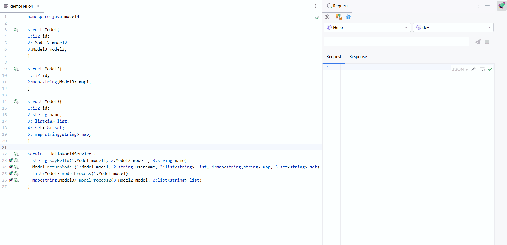

### 插件依赖说明

本插件依赖作者开发的另一款免费插件 **Thrift Assistant**。  
你无需手动安装，在安装 **Thrift Request** 时会自动安装。

> ⚠️ 注意：由于 Thrift Assistant 是基于 **Thrift Support** 插件开发的，为了避免兼容问题，请卸载其他基于 Thrift Support 的插件。

---

### 使用教程

#### 1. 添加项目与环境

在使用插件发送请求前，请先添加 **项目** 和 **环境配置**，插件将基于环境统一管理请求。  
> 请求前缀必须为格式：`ip:port`（如：`127.0.0.1:9090`）

#### 2. 自动生成请求参数

在 `.thrift` 文件中，找到某个 `service` 下的方法。你会看到方法名前有一个 **火箭图标 🚀**。

点击后，插件会自动在 Thrift Request 界面中生成参数模板：

- 参数名不可更改；
- 参数格式必须与 `.thrift` 文件一致；
- 值可自行修改。

#### 3. 发送请求

点击 **发送按钮**，插件会自动请求服务端接口并展示响应内容。  
在 Response 面板中你可以：

- 查看返回值
- 切换 Tab 查看原始结果、请求状态、日志等信息

